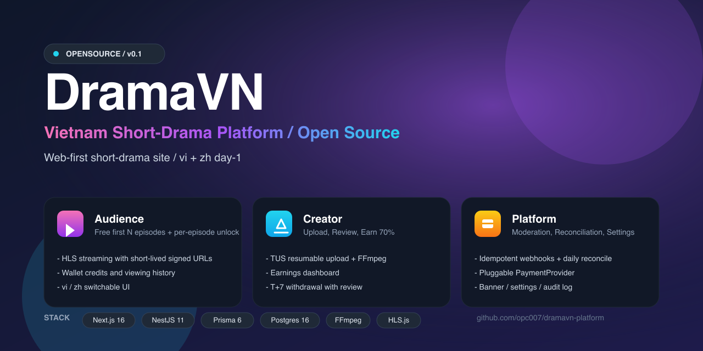

# Velvet · Spicy Short Drama Platform

> **Velvet** 短剧独立站开源脚手架：观众可看、创作者可上传分成、平台可抽佣。  
> 面向欧美成人言情 / 禁忌恋题材；双语（vi + zh）Day 1，签名播放、幂等 Webhook、对账骨架均已内置。
>
> **本仓库不包含真实支付渠道实现**——支付仅保留抽象接口（`PaymentProvider`），由部署方按需接入 alipay / wechat / stripe / momo / zalopay / vietqr 等。



---

## ✨ 特性一览

- 🎬 **三端分工**：观众/创作者同站路径分区；管理端独立应用与域名（生产：`velvet.slc8.com` / `velvetadmin.slc8.com`）
- 🌐 **双语 Day 1**：vi（默认）+ zh，i18n key + slug 双绑
- 🔐 **签名播放**：HLS 短时签名 URL，片源不外泄
- 💰 **账本只认 VND**：订单保留实付币种 + 汇率快照，可审计
- ♻️ **幂等 + 对账骨架**：Webhook 重复推送不重复加款，日对账 Job 已留接口
- 🧾 **钱包乐观锁 + 事务**：写钱走 `version` 自旋，避免丢更新
- 🎥 **上传 → 转码 → 播放**：TUS 断点续传 + FFmpeg → 480p / 720p HLS
- 🧱 **创作者分账**：默认 70% / 30%（官方自制可记为 100% 平台）
- 🧰 **统一抽象**：支付、媒体、转码、鉴权均为可替换接口

---

## 🧱 技术栈

| 层 | 技术 |
|---|---|
| 用户端 | **Next.js 16** + React 19 + Tailwind v4 + hls.js（`apps/web`） |
| 管理端 | **Next.js 16** + TanStack Query + `@velvet/ui`（`apps/admin`） |
| API 服务 | **NestJS 11** + Prisma 6 + PostgreSQL 16 |
| Monorepo | **pnpm** workspaces + **Turborepo** |
| 媒体处理 | TUS 断点续传 + FFmpeg（480p / 720p HLS） |
| 鉴权 | JWT + 邮箱 / 手机号 OTP（可关可开）；管理端独立 Admin JWT |

---

## 📂 仓库结构

```
.
├── apps/
│   ├── web/          # 观众 / 创作者（:3000）
│   └── admin/        # Ops Velvet 管理端（:3001）
├── packages/
│   ├── ui/           # 共享 UI（shadcn 风格）
│   ├── api-client/   # 管理端类型化 API 客户端
│   ├── validators/   # Zod schemas
│   └── tsconfig/
├── services/
│   └── api/          # NestJS API（:4000）
├── docs/
├── assets/
└── README.md
```

---

## 🚀 快速开始（本地开发）

> 前置：Node ≥ 20、PostgreSQL 16、FFmpeg；包管理推荐 pnpm 10（`npx pnpm` 亦可）。

```bash
# 根目录安装
npx pnpm@10.14.0 install

# 1. 启动数据库（任选其一）
#    例如 docker run -p 5432:5432 -e POSTGRES_PASSWORD=postgres postgres:16

# 2. 启动后端
cd services/api
cp .env.example .env       # 编辑 DATABASE_URL 等
npx pnpm prisma:generate   # 或 npm run prisma:generate
npx pnpm prisma:deploy
npx pnpm prisma:seed
npx pnpm start:dev         # http://localhost:4000

# 3. 启动用户端
cd ../../apps/web
cp .env.example .env.local
npx pnpm dev               # http://localhost:3000

# 4. 启动管理端
cd ../admin
cp .env.example .env.local
npx pnpm dev               # http://localhost:3001
```

打开浏览器访问 `http://localhost:3000`（观众端）。  
管理端：`http://localhost:3001`（默认账号见 API `.env` 中的 `ADMIN_BOOTSTRAP_*`）。  
用户端访问 `/admin` 会 308 跳转到管理端。

### 生产域名

| 端 | 域名 | 应用 |
|---|---|---|
| 用户端（观众 / 创作者） | https://velvet.slc8.com | `apps/web` |
| 管理端 | https://velvetadmin.slc8.com | `apps/admin` |

前端通过 `NEXT_PUBLIC_WEB_HOST` / `NEXT_PUBLIC_ADMIN_HOST`（及对应 `*_URL`）配置；API 的 `ALLOWED_ORIGINS` 需同时放行两个源。

---

## 💳 关于支付（重要）

本仓库遵循 **「抽象保留，实现脱敏」** 原则：

- ✅ 保留：`PaymentProvider` 接口、Webhook 幂等框架、对账骨架、模拟支付接口
- ❌ 不包含：alipay / wechat / stripe 等任何渠道的私钥、签名逻辑、SDK 调用代码
- 🔧 接入方式：在你自己的 `providers/` 里实现 `PaymentProvider`，再注册到 `PaymentsService` 即可

详见 `services/api/src/payments/provider.interface.ts`。
